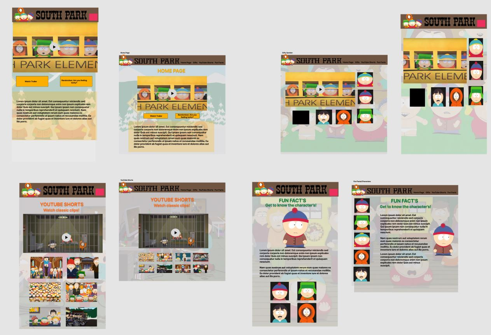
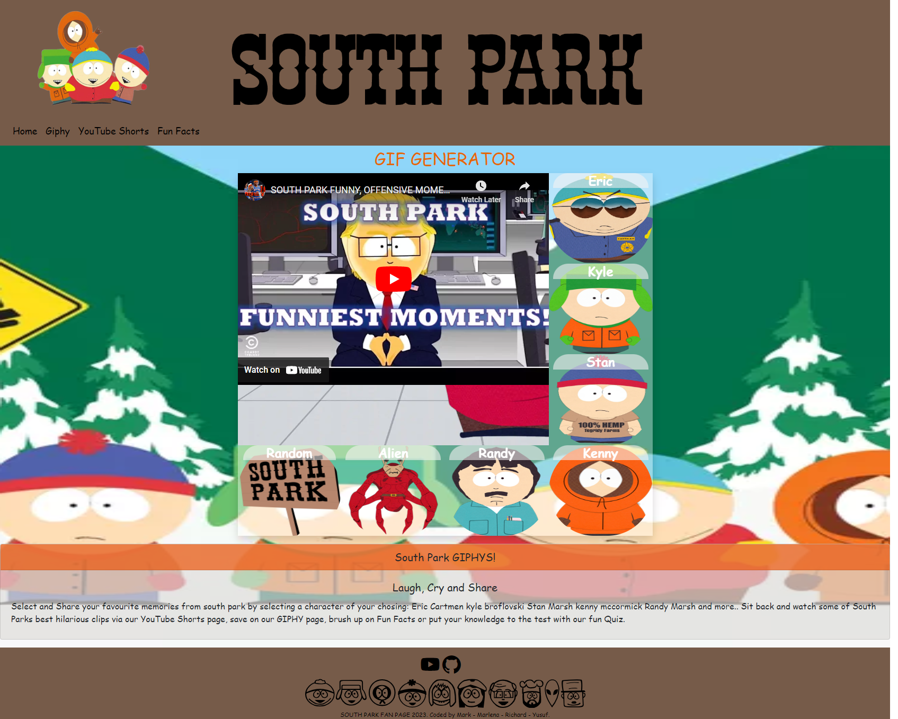
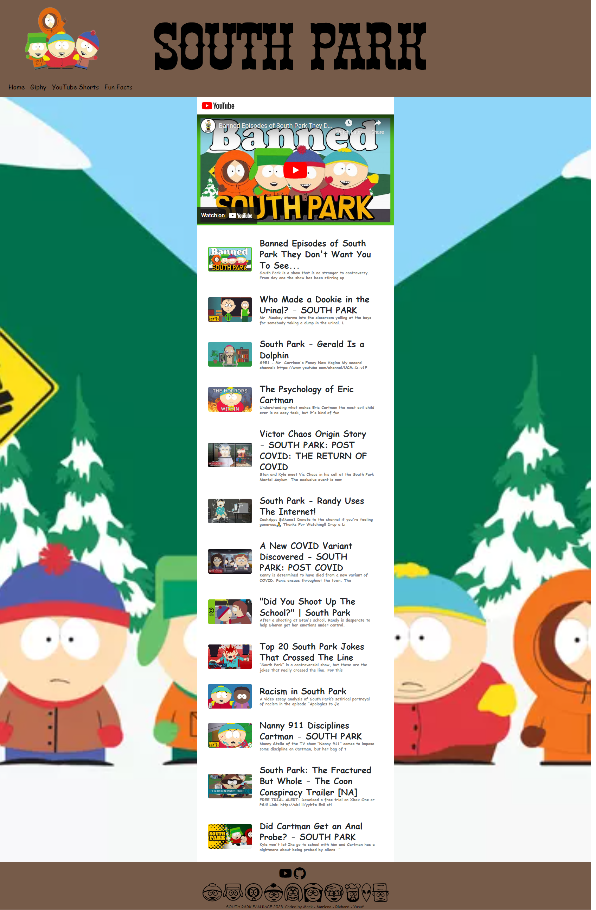

# South Park Fan Page- Project 1

As a group our main motivation was to conceive and execute a web page that solves a real-world problem by integrating data received from multiple server-side API requests. As a collective we decided to create a South Park Fan Page that uses can interact with all the pages. The interactions is as follows: A dynamic Home page which displays the websites main features via linked cards, a GIPHYS page allows users can flick through the different characters GIPHYS and save them, a dedicated YouTube Shorts page which list some of South Parks most funniest clips, and a Fun Fact page which allows the user to click on the main character faces to display some fun facts about them. We used two API's YouTube and GIPHY. We decided to build a Fan Page as individuals we had a shared common instrest. We wanted other South Park fans or users who haven't been exposed to South Park to have a page that they find informative and fun at the same time. Thus creating the page acts as a point of call for all things South Park.

## Web Page Features

Marlena- Home Page:

During the process of creating the Home page and main CSS layout for the pages I leant the importance of creating a responsive layout for all devices. I started by creating the Nav Bar and Footers using Bootstrap. I then had to talior the logo and written logo to respond accordingly. Once the Nav bar  and Footer was repsonding responsively the rest of the team then was able to pull from the main so that their pages had these features. I then began to work on the CSS which will be applied across all the pages. Using comments to make the CSS easier to read for the team really helped us be able to work in the agile methodology. Once the CSS was completed I then added Cards with buttons of featured pages of the webpage so that the user can access the pages either via the Nav bar drop downs or via the dynamic Cards. Once as a team we was all ready we merged the pages to the main branch. After which we fixed any conflicting bugs and made sure all the pages was working.

Mark- GIPHY Page:

The purpose of the GIPHY page is to allow the user to access GIF's of his favourite South Park Characters at the tap of a finger. The main purpose of this interface I assume will be mobile based where users can share GIF's in all social networks.
Using HTML to build a section within the Home Page starter code provided by Marlena, ready for the CSS to help create a basic, simple to use by mobile devices user inter face and then finally using JavaScript & JQuery to implement the GYPHY API.

Ric- YouTube Shorts Page: 

Yusuf- Fun Facts Page:

The purpose of the Fun Facts page was to give the user four of their favourite South Park Characters as options to pick fun facts from with just the click of a button. It was built using HTML, Bootstrap (with some separate CSS styling) and JavaScript. It is responsive, interactive and adapts across all viewports.

##Softwars Used

- VScode
- HTML
- CSS
- JavaScript
- Bootstrap
- Awesome Font 
- YOUTUBE PLAYER API https://developers.google.com/youtube/iframe_api_reference
- GIPHY API https://developers.giphy.com/
- Figma

##Project Screenshots
Figma Wireframe

Homepage

GIPHY Page

YouTube Shorts Page

Fun Facts Page

## Links

## License
MIT License

Copyright (c) 2022 MIT License.

Permission is hereby granted, free of charge, to any person obtaining a copy of this software and associated documentation files (the "Software"), to deal in the Software without restriction, including without limitation the rights to use, copy, modify, merge, publish, distribute, sublicense, and/or sell copies of the Software, and to permit persons to whom the Software is furnished to do so, subject to the following conditions:

The above copyright notice and this permission notice shall be included in all copies or substantial portions of the Software.

THE SOFTWARE IS PROVIDED "AS IS", WITHOUT WARRANTY OF ANY KIND, EXPRESS OR IMPLIED, INCLUDING BUT NOT LIMITED TO THE WARRANTIES OF MERCHANTABILITY, FITNESS FOR A PARTICULAR PURPOSE AND NONINFRINGEMENT. IN NO EVENT SHALL THE AUTHORS OR COPYRIGHT HOLDERS BE LIABLE FOR ANY CLAIM, DAMAGES OR OTHER LIABILITY, WHETHER IN AN ACTION OF CONTRACT, TORT OR OTHERWISE, ARISING FROM, OUT OF OR IN CONNECTION WITH THE SOFTWARE OR THE USE OR OTHER DEALINGS IN THE SOFTWARE.

